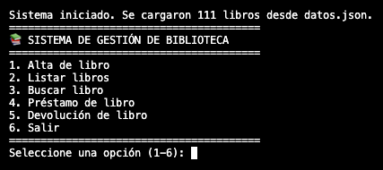

# Bookeeper 
### GestordeBiblioteca
En este proyecto desarrollaremos un Sistema de Gestión de Biblioteca en Python, cuyo propósito es permitir la administración básica de libros y préstamos en un entorno académico.

El objetivo principal es aplicar los conceptos de programación estructurada vistos en clase, utilizando listas, diccionarios, manejo de archivos y excepciones para resolver un problema realista y aplicable.

El programa funcionará en consola, con un menú de opciones numeradas que permitirán al usuario registrar, buscar y gestionar libros de manera sencilla.

## Cómo lo pongo a correr
1. Cloná el repo:
   ```zsh
   git clone https://github.com/tu-usuario/GestordeBiblioteca.git
   cd GestordeBiblioteca
   ```
2. (Opcional) Creá un entorno virtual:
   ```zsh
   python3 -m venv .venv
   source .venv/bin/activate  # En Windows: .venv\Scripts\activate
   ```
3. Ejecutá el programa:
   ```zsh
   python3 main.py
   ```

Al iniciar vas a ver cuántos libros encontró en `datos.json`. El archivo se mantiene en memoria hasta que elegís la opción 6 (Salir); recién ahí se guardan los cambios. Si borrás el JSON, el script se autocrea uno nuevo cuando salgas.

## Así se ve en acción


## Menú rápido
| Opción | Qué hace | Notas que aprendí por el camino |
| --- | --- | --- |
| 1 | Alta de libro | Pide título, autor, género y año; valida duplicados por título+autor para evitar entradas gemelas. |
| 2 | Listar libros | Calcula anchos dinámicos para que las columnas no se descuadren aunque cargues títulos larguísimos. |
| 3 | Buscar libro | Delega en una misma función los diferentes criterios (título/autor parcial, género/año exactos) y reutiliza la tabla de listado. |
| 4 | Préstamo | Solo permite alquilar libros cuyo estado es `Disponible`; el usuario elige la coincidencia por índice. |
| 5 | Devolución | Mismo flujo que el préstamo pero cambiando `Alquilado` → `Disponible`. |
| 6 | Salir | Guarda el JSON y muestra un mensaje de despedida con emoji, porque ¿por qué no? |

## Dataset incluido
El repo trae un `datos.json` bastante nutrido (novelas clásicas, distopías, etc.) para que pruebes sin cargar nada. Si preferís un catálogo limpio, podés renombrarlo o borrarlo antes de ejecutar y el programa empezará con una lista vacía.


